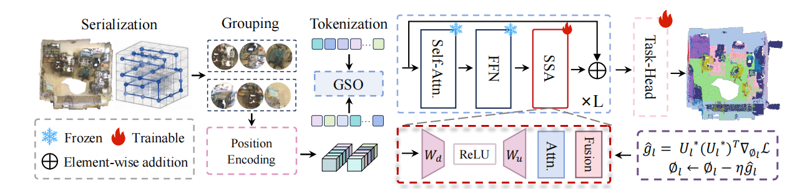
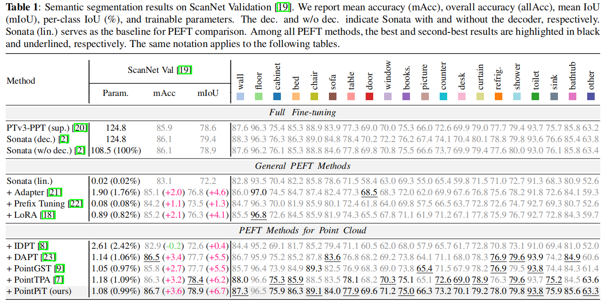
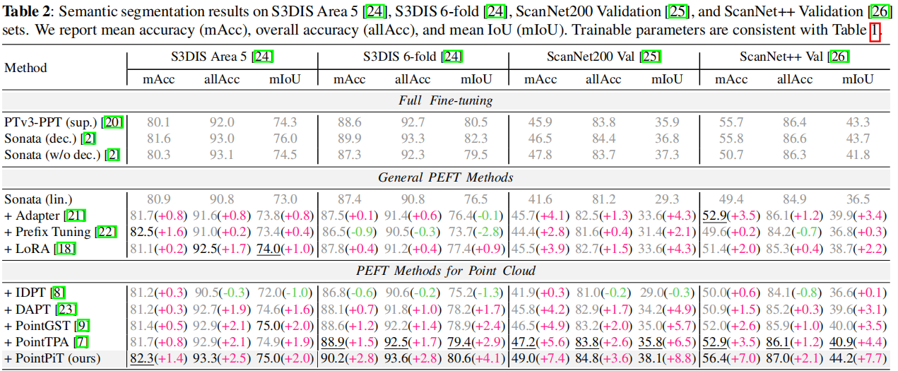

<div align="center">

# Partition-invariant Tuning for 3D Scene Understanding

<p align="center">
  <a href="https://arxiv.org/abs/2605.03438"></a>
  <a href="./LICENSE"></a>
</p>

PointPiT is a parameter-efficient fine-tuning framework designed for large-scale point cloud.

</div>

## 📨 News

- [2026/09/07] Initial repository release.
- [2026/09/09] Initial code release with ScanNet, ScanNet200, S3DIS,and ScanNet++ configurations.


## Abstract

Scene-level point cloud understanding remains challenging due to diverse geometries and spatial layouts. While pre-trained 3D point cloud foundation models (PFMs) offer strong transferability, full fine-tuning (FFT) incurs substantial computational and storage costs. Parameter-efficient fine-tuning (PEFT) provides a promising alternative, but existing PEFT methods largely focus on object-level point clouds and overlook serialization-induced partition variations in large-scale scenes. To address this issue, we propose PointPiT, a *partition-invariant tuning framework for scene-level point clouds. Specifically, a **Scene-aware Structural Adapter (SSA)** integrates local geometric patterns with global scene context to mitigate partition-induced representation shifts. Moreover, **Gradient Subspace Optimization (GSO)** selects informative and partition-stable update directions, suppressing partition-dependent variations during optimization. Extensive experiments across multiple scene-level benchmarks demonstrate that PointPiT achieves competitive or even superior performance to full fine-tuning with less than 1% of backbone's parameters, while achieving consistent state-of-the-art performance among representative PEFT methods.

## Overview

<div align="center">
  
</div>


## Main Results


|     Dataset    |                                      Config                                      |     mIoU    |     mAcc    |
| :------------: | :------------------------------------------------------------------------------: | :---------: |  :---------: |
|  ScanNet Val   |       [semseg-ptv3-scannet-pointpit.py](./configs/ptv3-pointpit/semseg-ptv3-scannet-pointpit.py)       | 78.9%  | 86.7%  |
| S3DIS Area 5   |         [semseg-ptv3-s3dis-pointpit.py](./configs/ptv3-pointpit/semseg-ptv3-s3dis-pointpit.py)         | 75.0%  | 82.3%  |
| S3DIS 6-fold   |         [semseg-ptv3-s3dis-pointpit.py](./configs/ptv3-pointpit/semseg-ptv3-s3dis-pointpit.py)         | 80.6%  | 90.2%  |
| ScanNet200 Val | [semseg-ptv3-scannet200-pointpit.py](./configs/ptv3-pointpit/semseg-ptv3-scannet200-pointpit.py) | 38.1% |49.0% |
| ScanNet++ Val  |   [semseg-ptv3-scannetpp-pointpit.py](./configs/ptv3-pointpit/semseg-ptv3-scannetpp-pointpit.py)   | 44.2%  | 56.4%  |

<div align="center">
  
</div>

<div align="center">
  
</div>

## Installation

The tested stack is Python 3.10, PyTorch 2.5.0, and CUDA 12.4.

```bash
git clone https://github.com/gzhhhhhhh/PointPiT.git
cd PointPiT
conda env create -f environment.yml
conda activate PointPiT
```

The environment file builds the bundled PointOps extensions. If the automatic
build is interrupted, install them manually after activating the environment:

```bash
pip install -v ./libs/pointops
pip install -v ./libs/pointgroup_ops
```

For a different CUDA/PyTorch combination, follow the upstream
[Pointcept installation guide](https://github.com/Pointcept/Pointcept#installation)
and install a matching `spconv` and `flash-attn` build.

## Data preparation

Preprocess ScanNet, ScanNet200, S3DIS, or ScanNet++ following the
[Pointcept data preparation guide](https://github.com/Pointcept/Pointcept#data-preparation),
then link the processed directory under `data/`:

```bash
mkdir -p data
ln -s /path/to/processed/scannet data/scannet
ln -s /path/to/processed/s3dis data/s3dis
ln -s /path/to/processed/scannetpp data/scannetpp
```

Expected layout:

```text
PointPiT/
├── configs/
│   ├── _base_/
│   └── ptv3-pointpit/
├── data/
│   ├── scannet -> /path/to/processed/scannet
│   ├── s3dis -> /path/to/processed/s3dis
│   └── scannetpp -> /path/to/processed/scannetpp
├── pointcept/
│   ├── engines/
│   ├── models/
│   │   ├── peft/pointpit.py                       # SSA
│   │   └── point_transformer_v3/
│   │       └── point_transformer_v3_pointpit.py  # PTv3 + SSA
│   └── utils/gso.py                              # GSO
├── scripts/
├── tools/
├── environment.yml
└── README.md
```

## Pretrained checkpoint

Download the public
[Sonata base checkpoint](https://huggingface.co/facebook/sonata/blob/main/pretrain-sonata-v1m1-0-base.pth)
and pass its local path with `-w`. PointPiT checkpoints are not required to
start training.

## Training

The commands below use one machine with eight GPUs. Adjust `-g` to the number
of visible GPUs. The default PointPiT setting is `r=64`, `q=32`, and
`lambda=0.5`.

```bash
# ScanNet
sh scripts/train.sh -m 1 -g 8 -d ptv3-pointpit \
  -c semseg-ptv3-scannet-pointpit \
  -n semseg-ptv3-scannet-pointpit \
  -w /path/to/pretrain-sonata-v1m1-0-base.pth

# ScanNet200
sh scripts/train.sh -m 1 -g 8 -d ptv3-pointpit \
  -c semseg-ptv3-scannet200-pointpit \
  -n semseg-ptv3-scannet200-pointpit \
  -w /path/to/pretrain-sonata-v1m1-0-base.pth

# S3DIS Area 5
sh scripts/train.sh -m 1 -g 8 -d ptv3-pointpit \
  -c semseg-ptv3-s3dis-pointpit \
  -n semseg-ptv3-s3dis-pointpit \
  -w /path/to/pretrain-sonata-v1m1-0-base.pth

# ScanNet++
sh scripts/train.sh -m 1 -g 8 -d ptv3-pointpit \
  -c semseg-ptv3-scannetpp-pointpit \
  -n semseg-ptv3-scannetpp-pointpit \
  -w /path/to/pretrain-sonata-v1m1-0-base.pth
```

Append `-dec` to the PointPiT config name to use the pretrained decoder, for
example `semseg-ptv3-scannet-pointpit-dec`. Linear probing, decoder probing,
and full fine-tuning configs are included for controlled comparisons.

### GSO configuration

Each PointPiT config contains the following options:

```python
gso = dict(
    enabled=True,
    rank=32,                 # q in the paper
    partition_weight=0.5,   # lambda in the paper
    partition_count=2,
    history_size=16,
    warmup_steps=8,
    update_interval=8,
)
```

GSO performs one forward/backward pass per partition. Set `enabled=False` for
the SSA-only ablation. The implementation keeps a short gradient history and
solves the eigensystem in its low-rank span, avoiding an intractable dense
`D_phi x D_phi` matrix.

## Evaluation

```bash
sh scripts/test.sh -m 1 -g 8 -d ptv3-pointpit \
  -n semseg-ptv3-scannet-pointpit \
  -w model_best
```

For S3DIS 6-fold evaluation, train all six areas and run:

```bash
python tools/test_s3dis_6fold.py --record_root /path/to/six-area-records
```

## Acknowledgements

This repository is built on
[Pointcept](https://github.com/Pointcept/Pointcept),
[Point Transformer V3](https://arxiv.org/abs/2312.10035), and
[Sonata](https://arxiv.org/abs/2503.16429). Please follow the licenses and citation requirements of the upstream
projects.

## Citation

If you find this repository useful in your research, please consider giving a star ⭐ and a citation.

<!-- 以下段落暂不发布，先注释掉
这是被注释的内容，包括 *斜体* 和 **粗体** 都不会渲染。


```bibtex
@inproceedings{pointpit2027,
  title     = {Parameter-Efficient Fine-Tuning for 3D Scene Understanding},
  author    = {Anonymous},
  booktitle = {IEEE International Conference on Acoustics, Speech and Signal Processing},
  year      = {2027}
}
```
-->